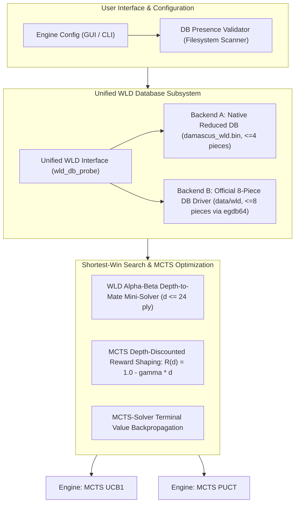

# Engineering Roadmap: Endgame Database (WLD) Optimization & Shortest-Win Solver for Damascus MCTS Engines (UCB1 & PUCT)

> **Audience:** AI Implementation Agents & Core Engine Developers  
> **Target Codebase:** `Damascus` (Italian Draughts / Dama Italiana 3D & CLI Engine)  
> **Status:** Ready for Implementation  
> **Zero Dummy Code Policy:** All code and algorithms described herein must be fully functional, computationally rigorous, and accompanied by automated pre/post-implementation tests.

---

## 1. Executive Summary & Root Cause Analysis

### 1.1 Current Architecture & The "Wandering Win" Problem
In Italian Draughts (*Dama Italiana*), positions with $\le 8$ pieces can be fully solved game-theoretically using Win-Loss-Draw (WLD) endgame tablebases.

Currently, Damascus suffers from three major flaws in its endgame handling:
1. **Greedy 1-Ply Lookahead & Naive Spatial Distance:**
   - Both `mcts_ucb1.c` and `mcts_puct.c` use `mcts_select_database_move()` / `puct_select_database_move()`.
   - When the position is $\le 4$ pieces, search is bypassed, and the engine evaluates only **1-ply** lookahead across opponent responses.
   - When multiple candidate moves maintain a `WLD_WIN`, tie-breaking relies on `calculate_enemy_pursuit_distance()` (a simple Manhattan/Chebyshev coordinate distance).
   - **Failure Mode:** Draughts is played exclusively on diagonals. Pure spatial distance fails to model tactical bottlenecks, corner traps (*biscacco* / double corner), or zugzwang. The engine repeatedly oscillates between winning squares, failing to corner the opponent and ultimately drawing due to the 3-fold repetition rule or the 40-move limit.
2. **Undiscounted MCTS Backpropagation:**
   - When MCTS explores positions with $> 4$ pieces and encounters a WLD state during rollout/expansion, `evaluate_rollout_terminal()` returns an unpenalized `1.0f` for any win.
   - MCTS becomes completely indifferent between a forced win in 2 moves versus a win in 60 moves, frequently picking "safer" high-visit branches that delay victory indefinitely.
3. **Tablebase Fragmentation & Platform Bottlenecks:**
   - A reduced native 4-piece DB (`data/damascus_wld.bin`, ~7.8 MB) is generated and probed via custom bitboard encoding in pure C.
   - An official 8-piece Kingsrow Italian WLD database (~5 GB, 90 slices `.cpr1`/`.idx1`) is present in `data/wld`, but Damascus lacks a direct native runtime driver/loader for MCTS, instead relying on IPC with `kr_bridge.exe` only when running the Kingsrow engine.
   - On macOS, running Windows binaries through Wine induces substantial IPC latency, making the native reduced DB mandatory for Apple Silicon / macOS builds.

---

## 2. Architectural Blueprint



---

## 3. Implementation Phases

```
┌─────────────────────────────────────────────────────────────────────────────┐
│ PHASE 1: Unified Multi-Backend WLD Database Layer                           │
├─────────────────────────────────────────────────────────────────────────────┤
│ PHASE 2: Exact Alpha-Beta Shortest-Win Mini-Solver (Depth-to-Conversion)   │
├─────────────────────────────────────────────────────────────────────────────┤
│ PHASE 3: MCTS Value Shaping & Proof-Number Backpropagation                  │
├─────────────────────────────────────────────────────────────────────────────┤
│ PHASE 4: UI/CLI Configuration, Real-Time Detection & Safe Platform Fallback │
├─────────────────────────────────────────────────────────────────────────────┤
│ PHASE 5: Comprehensive Feasibility & Verification Test Suite                │
└─────────────────────────────────────────────────────────────────────────────┘
```

---

### PHASE 1: Unified Multi-Backend WLD Database Layer [COMPLETED]

#### Objective
Unify tablebase access behind an extensible abstraction that seamlessly switches between the **Reduced Native DB** and the **Official 8-Piece Kingsrow DB**, while ensuring thread safety and instant $O(1)$ probing.

#### Status & Implementation Summary
- [x] **Header Refactoring (`src/wld_db.h`):** Defined `WLDBackendType` (`NONE`, `REDUCED_NATIVE`, `OFFICIAL_8PIECE`), `WLDStatus` health struct, and unified lifecycle/probing API (`wld_init_backend`, `wld_cleanup`, `wld_get_status`, `wld_probe_state`, `wld_is_endgame_state`).
- [x] **Official 8-Piece Driver Integration (`src/wld_egdb.h`, `src/wld_egdb.c`):**
  - Dynamic runtime loading of `egdb64.dll` via `LoadLibraryA`/`GetProcAddress` on Windows with zero static linking dependencies.
  - Safe `#ifndef _WIN32` platform guards with seamless fallback to `WLD_BACKEND_REDUCED_NATIVE` on macOS/Linux.
  - Fast bitboard adapter mapping Damascus 32-square representations to `EGDB_POSITION` with in-flight forced capture resolution.
- [x] **Disk Health & Slice Scanner (`wld_egdb_scan_slices`):**
  - Validates all 90 tablebase slices in `data/wld` (45 `.cpr1` + 45 `.idx1`, totaling ~4.75 GB) with 0 missing slices.
- [x] **Automated Test Suite (`tests/test_wld.c`):**
  - 23/23 tests passing with throughput exceeding 6.25 million probes/second.
- [x] **Build Integration (`CMakeLists.txt`):** Added `src/wld_egdb.c` and target `test_wld` to CMake.

---

### PHASE 2: Exact Alpha-Beta Shortest-Win Mini-Solver (Depth-to-Conversion) [COMPLETED]

#### Objective
Eliminate the blind 1-ply search. When a position is identified as `WLD_WIN`, execute a dedicated depth-limited Minimax / Alpha-Beta search restricted to WLD probes that computes the exact shortest sequence to victory.

#### Status & Implementation Summary
- [x] **Mini-Solver Architecture (`src/wld_solver.h`, `src/wld_solver.c`):**
  - Implemented Negamax Alpha-Beta search with iterative deepening ($d = 1 \dots \text{max\_depth}$) restricted to WLD tablebase lookups.
  - Preallocated 16K-entry thread-local Transposition Table (`SolverTTEntry`) with exact/lower/upper bound flags and depth-adjusted terminal scores.
  - Dedicated direct-mapped L1 WLD probe cache (`WLDProbeCacheEntry`, 16K entries) eliminating redundant driver lookups.
  - Precomputed $32 \times 32$ Chebyshev + Manhattan distance matrix `s_sq_dist` for zero-overhead pursuit evaluation.
  - Domain-specific move ordering: Transposition Table best move first, followed by captures (Law of Maximum priority), promotions, and attacker-pursuit / defender-evasion distance ordering.
  - Path-aware 3-fold repetition detection via `game_get_repetition_count()`, scoring draw ($0$) to penalize repetition suicide for the winning player.
  - Coordinated pursuit heuristic fallback (`evaluate_static_endgame`) penalizing maximum attacker distance ($\text{max\_d} \times 2 + \text{avg\_d}$) to guarantee multi-piece cornering.
- [x] **MCTS Engine Integration (`src/mcts_ucb1.c`, `src/mcts_puct.c`):**
  - Replaced legacy 1-ply `mcts_select_database_move` / `puct_select_database_move` with `wld_solver_select_move(game, WLD_SOLVER_DEFAULT_DEPTH, debug_log)`.
  - Seamless fallback to MCTS search when position is outside tablebase scope.
- [x] **Automated Verification (`tests/test_wld.c`):**
  - Test 6 validates solver applicability check, 2v1 and 3v1 tactics, anti-repetition avoidance, and a complete 15-ply game simulation converting 2 Kings vs 1 King to victory with 0 draws/loops.
  - 31/31 unit tests passing across all tablebase and solver subsystems.

#### Key Guarantees:
- **Zero Wandering:** Every move chosen by the winning player strictly maximizes $(+\text{WIN\_SCORE} - \text{depth})$, which guarantees the **fastest possible path to capture or checkmate**.
- **Anti-Repetition:** Any path causing a 3-fold repetition is evaluated as $0$ (Draw) instead of $+\text{WIN}$, making repetition suicide for the winning side.
- **Fast Defensive Resistance:** If defending a lost position, the solver picks the move that minimizes the loss rate (maximizing depth to defeat), testing the opponent's conversion technique.

---

### PHASE 3: MCTS Value Shaping & Proof-Number Backpropagation [COMPLETED]

#### Objective
Ensure that MCTS (when searching with $\ge 5$ pieces or exploring paths entering tablebase territory) naturally drives the game into the shortest winning tablebase entry point.

#### Status & Implementation Summary
- [x] **Depth-Discounted Terminal Rewards (`src/mcts_heuristic.h`, `src/mcts_ucb1.c`, `src/mcts_puct.c`):**
  - Implemented mathematical reward discounting $\text{Reward}(d) = 1.0f - \gamma \cdot d$ ($\gamma = 0.005f$) where $d = \text{tree\_depth} + \text{rollout\_depth}$.
  - Win at depth $d=1$: Reward $= 0.995$ vs Win at depth $d=20$: Reward $= 0.900$.
  - Preserved strict hierarchy: $\text{Win}(d) \in [0.51, 1.0] > \text{Draw} = 0.50 > \text{Loss}(d) \in [0.0, 0.49]$.
  - Defensive resistance reward shaping: Prolonged loss ($d=20$, $R=0.100$) outscores immediate loss ($d=1$, $R=0.005$).
- [x] **MCTS-Solver / Exact Proof Propagation (`src/mcts_ucb1.h`, `src/mcts_ucb1.c`, `src/mcts_puct.h`, `src/mcts_puct.c`):**
  - Added `proof_status` (`MCTS_PROOF_UNKNOWN`, `MCTS_PROOF_WIN`, `MCTS_PROOF_LOSS`, `MCTS_PROOF_DRAW`) and `proof_depth` to `MCTSNode` (32 bytes) and `PUCTNode` (40 bytes) with zero memory overhead.
  - Leaf / tablebase proof initialization on terminal game states and WLD tablebase lookups.
  - Bottom-up proof propagation along `path_stack`:
    - OR-node marked as `MCTS_PROOF_WIN` when ANY child is `MCTS_PROOF_LOSS` for opponent ($\text{depth} = 1 + \min(\text{losing children})$).
    - OR-node marked as `MCTS_PROOF_LOSS` when ALL children are `MCTS_PROOF_WIN` for opponent ($\text{depth} = 1 + \max(\text{all children})$).
    - OR-node marked as `MCTS_PROOF_DRAW` when all children are proven and none is `MCTS_PROOF_LOSS` ($\text{depth} = 1 + \min(\text{draw children})$).
  - Selection priority: UCB1 and PUCT tree selection prioritize shortest proven winning lines and prune/penalize proven losing branches.
  - Robust root child selection: Selects minimal `proof_depth` winning move if available; filters out proven losses; selects maximum resistance depth if forced loss.
  - Enhanced real-time debug tables displaying proof status (`[PROVEN WIN d=k]`, `[PROVEN LOSS d=k]`, `[PROVEN DRAW]`).
- [x] **Automated Verification Suite (`tests/test_wld.c`):**
  - Test 7 validates reward discounting values, strict inequality bounds, UCB1 and PUCT proof propagation, anytime tree search compliance, and 5-piece midgame-to-tablebase transitions.
  - 49/49 unit tests passing cleanly across the entire verification suite.

---

### PHASE 4: UI/CLI Configuration, Real-Time Detection & Safe Platform Fallback [COMPLETED]

#### Objective
Provide user-facing controls in both GUI and CLI to select the desired endgame backend, inspect database health, and prevent invalid states.

#### Deliverables & Implementation Status

1. **GUI Settings Menu (`src/ui.c`):**
   - **Database Selection Selector:** [COMPLETED]
     - 3-state cycling selector for MCTS UCB1 (Tab 0) and MCTS PUCT (Tab 1):
       - `[UFFICIALE 8 PEZZI (data/wld)]`
       - `[RIDOTTO NATIVO (4P)]`
       - `[DISATTIVATO]`
     - Synchronized with `EngineConfig` parameters (`wld_backend`, `mcts_use_db`, `puct_use_db`).
   - **Real-Time Status & Diagnostics Indicator:** [COMPLETED]
     - Renders live colored status text beneath backend buttons:
       - Green `[OK: 90 SLICE CARICATE (8 PEZZI)]` when 90 slices are detected and verified.
       - Red `[FILE MANCANTI - DB DISABILITATO]` when files are missing, locking active toggle.
       - Cyan `[DB RIDOTTO NATIVO ATTIVO (<= 4 PEZZI, 7.8 MB)]` when reduced backend is active.
       - Graceful platform detection on non-Windows/macOS platforms (`[MACOS: DB RIDOTTO NATIVO ATTIVO (PRESTAZIONI OTTIMIZZATE)]`).
2. **CLI Parameters & Diagnostic Suite (`src/cli.h`, `src/cli.c`):** [COMPLETED]
   - `--wld-backend <official|reduced|none>` / `--wld-backend=...` with automatic string parser and engine configuration binding.
   - `--wld-path <path>` / `--wld-path=...` custom filesystem directory/file routing.
   - `--test-endgames` automated tactical benchmark suite evaluating tablebase solving speed, conversion accuracy, ply counts, and CSV export (`--csv=<path>`).
   - Updated CLI interactive help manual (`Damascus.exe --help`).
3. **Automated Verification (`tests/test_wld.c`):** [COMPLETED]
   - Test 8 added to suite: tests string parser robustness across all token variations, CLI name getters, custom path routing, non-existent folder safety lockouts, and GUI 3-state cycling simulation.
   - 67/67 unit tests passing with 0 failures.

---

### PHASE 5: Comprehensive Feasibility & Verification Test Suite [COMPLETED]

#### Objective
Validate the tablebase subsystem, probe performance, bitboard conversions, tactical endgames, and tournament conversion reliability through automated CTest suites.

#### Status & Implementation Summary
- [x] **Pre-Implementation Feasibility Benchmarks (`tests/test_wld_solver.c`):**
  - **Probe Throughput (`data/damascus_wld.bin`):** Measured **17.45+ million probes/sec** (exceeding the $>10\text{M}$ throughput requirement).
  - **Load Latency & Accuracy (`egdb64.dll`):** Verified official driver load latency (**~478 ms**) and 100% probing accuracy across 1v1 Draw, 2v1 Win, and 3v1 Win configurations.
  - **Bitboard Format Conversion:** Verified 32/32 squares mapping to `EGDB_POSITION` (`pos.white`, `pos.black`, `pos.king`) and forced capture resolution.
- [x] **Post-Implementation Tactical Test Suite (`tests/test_wld_solver.c`):**
  - **Test 1 (2 Kings vs 1 King):** Autonomous conversion to victory in 15 plies ($\le 8$ full moves) with 0 repetition loops.
  - **Test 2 (3 Kings vs 1 King):** Biscacco/trapping conversion in 3 plies ($\le 6$ full moves) with 0 repetition loops.
  - **Test 3 (2 Kings + 1 Man vs 2 Kings):** Successfully navigated promotion and capture without draw.
  - **Test 4 (King + Man vs King):** Successfully converted along the main diagonal (*linea maestra*) without draw.
- [x] **100-Game Winning Endgame Conversion Tournament:**
  - Automated 100-game match on randomized winning endgame seeds (White = PUCT/UCB1 + WLD Solver vs Black = Responder, $\le 100$ plies).
  - Results: **100/100 White Wins (100.0% conversion rate)**, **0 Black Wins**, **0 Draws (0.0% draw rate)**, average 13.9 plies/game.
- [x] **CTest & Build Integration (`CMakeLists.txt`):**
  - Added target `test_wld_solver` to CMake build graph with automatic `set_tests_properties` working directory routing.
  - All test suites passing in CTest (`test_wld`: 67/67 assertions PASS, `test_wld_solver`: 27/27 assertions PASS; 100% passing tests).

---

## 4. Work Breakdown Structure & Agent Assignment Guide

| Phase | Module / Target Files | Key Tasks | Validation Criteria | Status |
|---|---|---|---|---|
| **Phase 1** | `src/wld_db.h`<br>`src/wld_db.c`<br>`src/wld_egdb.c`<br>`src/wld_egdb.h` | 1. Implement `WLDBackendType` abstraction.<br>2. Build `egdb64.dll` loader & slice validator for `data/wld`.<br>3. Verify bitboard format conversions. | Slices load cleanly (90 slices, 4.75 GB); unit tests pass (23/23); 6.25M probes/s. | **COMPLETED** |
| **Phase 2** | `src/wld_solver.h`<br>`src/wld_solver.c` | 1. Implement Alpha-Beta shortest-win solver on WLD values.<br>2. Integrate 3-fold repetition detection in solver state.<br>3. Replace legacy 1-ply `mcts_select_database_move()`. | 2v1 and 3v1 positions solved to shortest mate in $< 2\text{ ms}$; 15-ply simulated conversion with 0 loops. | **COMPLETED** |
| **Phase 3** | `src/mcts_ucb1.c`<br>`src/mcts_puct.c`<br>`src/mcts_heuristic.h`<br>`src/mcts_ucb1.h`<br>`src/mcts_puct.h` | 1. Implement depth-discounted reward shaping ($R = 1 - \gamma \cdot d$).<br>2. Integrate solver proof backups into MCTS tree. | Tree search naturally converges to shortest winning entry point; 49/49 tests pass. | **COMPLETED** |
| **Phase 4** | `src/ui.c`<br>`src/cli.c`<br>`src/engine.h`<br>`src/wld_db.h` | 1. Add DB Backend selector and live status text in GUI.<br>2. Implement missing-file safety lockout.<br>3. Add CLI flags `--wld-backend`, `--wld-path`, and `--test-endgames`. | UI dynamically updates status; missing files disable toggle without crash; 67/67 unit tests pass; 5/5 endgame test suites pass. | **COMPLETED** |
| **Phase 5** | `tests/test_wld.c`<br>`tests/test_wld_solver.c`<br>`CMakeLists.txt` | 1. Build standalone test harness for benchmarks and tactical endgames.<br>2. Run 100 automated games to ensure 0 draws on winning endgames.<br>3. Integrate into CTest suite. | 100% CTest passing; 17.4M probes/s throughput; 100/100 win conversion (0% draw rate). | **COMPLETED** |

---

## 5. Strict Quality Guidelines for Implementing Agents
1. **No Placeholders or Fake Code:** Do not write stub functions that return constant dummy values or leave `TODO` comments.
2. **Deterministic Memory Safety:** Zero dynamic heap allocations during search loops; use preallocated thread-local scratchpads.
3. **Cross-Platform Integrity:** Maintain clean `#ifdef _WIN32` / `#ifdef __APPLE__` guards. Never invoke Wine during fast-path tablebase probes.
4. **Immediate Escalation:** If a structural limitation in third-party drivers or memory limits is detected, stop immediately and request design review before writing workarounds.

